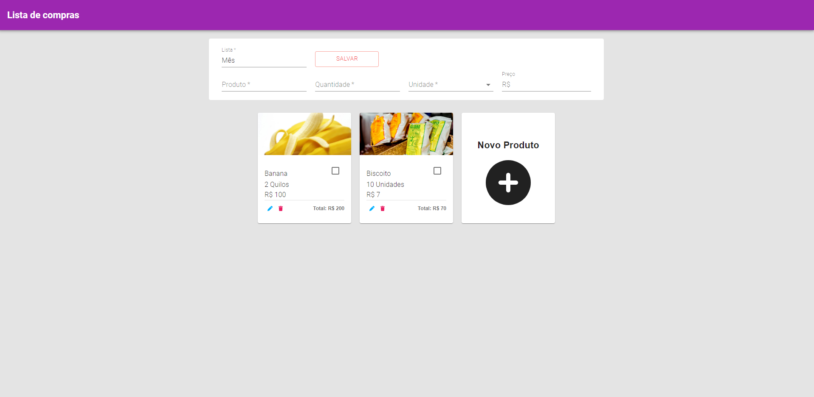

<h1><strong>Lista de Compras</strong></h1> Version: 1 

 
 
<strong><h2>🎯 Sobre</h2></strong>

A proposta desse desenvolvimento consiste na implementação de um site que simule uma lista de compras que armazene no local storage e use o redux.

 
 <strong><h2>🛠️ Tecnologias usadas</h2></strong>

[- <strong>ReactJS</strong>](https://pt-br.reactjs.org/)
[- <strong>Material UI</strong>](https://v3.mui.com/)
[- <strong>Redux</strong>](https://redux.js.org/)
[- <strong>Redux Saga</strong>](https://redux-saga.js.org/)

 
<strong><h2>⚙️ Instalação</h2> </strong>

<strong>🔙 Pré-requisito </strong>

Antes de começar, você precisará ter instalado em seu computadore as seguintes ferramentas: [Git](https://git-scm.com/) , [Node.js](https://nodejs.org/en/) e [Yarn](https://yarnpkg.com/) .
Além disso, é bom ter um editor para trabalhar com seu código, como o [VSCode](https://code.visualstudio.com/).
Você vai precisar ter uma conta no https://developers.google.com/custom-search/v1/introduction?hl=pt para fazer as chamadas via api e criar um arquivo .env colocando a chave da KEY (REACT_APP_GOOGLE_KEY=) e CX(REACT_APP_GOOGLE_CX=). 
CASO DESEJE IGNORAR QUALQUER INSTALAÇÃO, SÓ ACESSE https://lista-de-compras-redux-saga-8a4tpc0gf-realcaldeira.vercel.app/

 

<strong>🔽 Clonando o repositório </strong>

<pre>via HTTPS
$ git clone https://github.com/realcaldeira/listaDeCompras-redux-saga.git </pre>

<strong>🖥️ Iniciando o aplicativo</strong>

<pre>
# Acesse a pasta com comando <strong>cd </strong> 

# Volte para a pasta anterior do aplicativo 
$ cd ..

# Instale as dependências
$ yarn

Este projeto foi feito com ❤ por Lucas Caldeira
